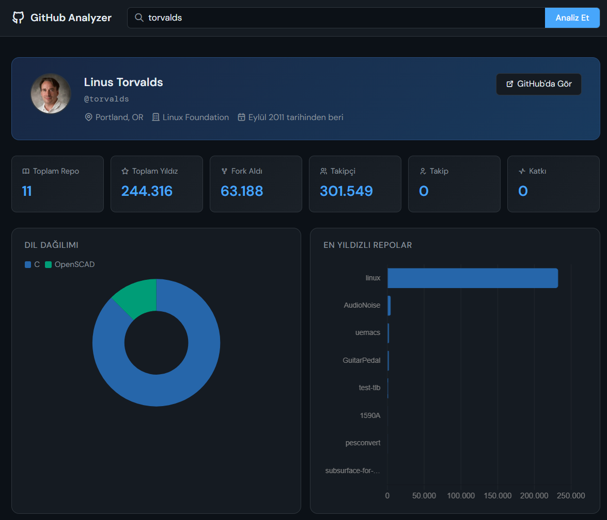
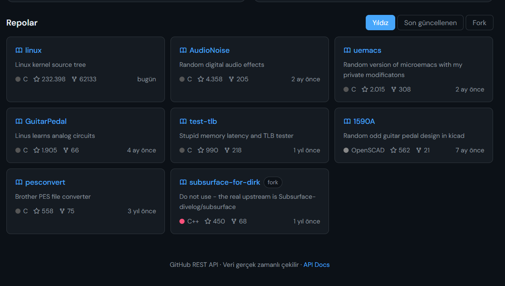

# GitHub Profile Analyzer
A dashboard for analyzing GitHub profiles. Built with React, TypeScript, and Vite.





## Features
- Profile overview with bio, location, and account age
- Language distribution chart
- Most starred repositories chart
- Contribution activity heatmap
- Repository list sortable by stars, recent activity, or forks

## Tech Stack
- React 18
- TypeScript
- Vite
- Chart.js + react-chartjs-2
- GitHub REST API (no authentication required)
- GitHub Actions for automated deployment

## Getting Started
```bash
npm install
npm run dev
```

## Deployment
The project deploys automatically to GitHub Pages on every push to `main`.

To set up deployment on your own fork:
1. Go to Settings -> Pages
2. Set source to “GitHub Actions”
3. Push to main
The live URL will be at `https://<username>.github.io/GitHub-Profile-Analysis-Tool/`

## API Rate Limits
GitHub's REST API allows 60 unauthenticated requests per hour. If you need more, create a personal access token at github.com/settings/tokens and add it to `src/api/github.ts`:

```ts
headers: {
  Authorization: `Bearer ${import.meta.env.VITE_GITHUB_TOKEN}`,
                }
```

Add your token to a `.env` file (never commit this file):

```
VITE_GITHUB_TOKEN=ghp_xxxxxxxxxxxxx
```

----------------------------------------------------------------------------------

# GitHub Profil Analiz Aracı
GitHub profillerini analiz etmek için bir kontrol paneli. React, TypeScript ve Vite ile geliştirilmiştir.


## Özellikler
- Kişisel bilgi, konum ve hesap yaşını içeren profil özeti
- Dil dağılım grafiği
- En çok yıldız alan depo grafiği
- Katkı etkinliği ısı haritası
- Yıldızlara, son aktiviteye veya çatallara göre sıralanabilir depo listesi

## Teknoloji Yığını
- React 18
- TypeScript
- Vite
- Chart.js + react-chartjs-2
- GitHub REST API (kimlik doğrulama gerekmez)
- Otomatik dağıtım için GitHub Actions

## Başlangıç
```bash
npm install
npm run dev
```

## Dağıtım
Proje, `main`'e her itme işleminde GitHub Pages'a otomatik olarak dağıtılır.

Kendi fork'unuzda dağıtımı kurmak için:
1. Ayarlar -> Sayfalar'a gidin
2. Kaynağı “GitHub Actions” olarak ayarlayın
3. Main'e itin
Canlı URL, `https://<kullanıcıadı>.github.io/GitHub-Profile-Analysis-Tool/` adresinde olacaktır

## API İstek Sınırları
GitHub'ın REST API'si saatte 60 adet kimlik doğrulaması yapılmamış istek izin verir. Daha fazlasına ihtiyacınız varsa, github.com/settings/tokens adresinden bir kişisel erişim jetonu oluşturun ve bunu `src/api/github.ts` dosyasına ekleyin:

```ts
headers: {
  Authorization: `Bearer ${import.meta.env.VITE_GITHUB_TOKEN}`,
                }
```

Token'ınızı bir `.env` dosyasına ekleyin (bu dosyayı asla commit etmeyin):

```
VITE_GITHUB_TOKEN=ghp_xxxxxxxxxxxxx
```